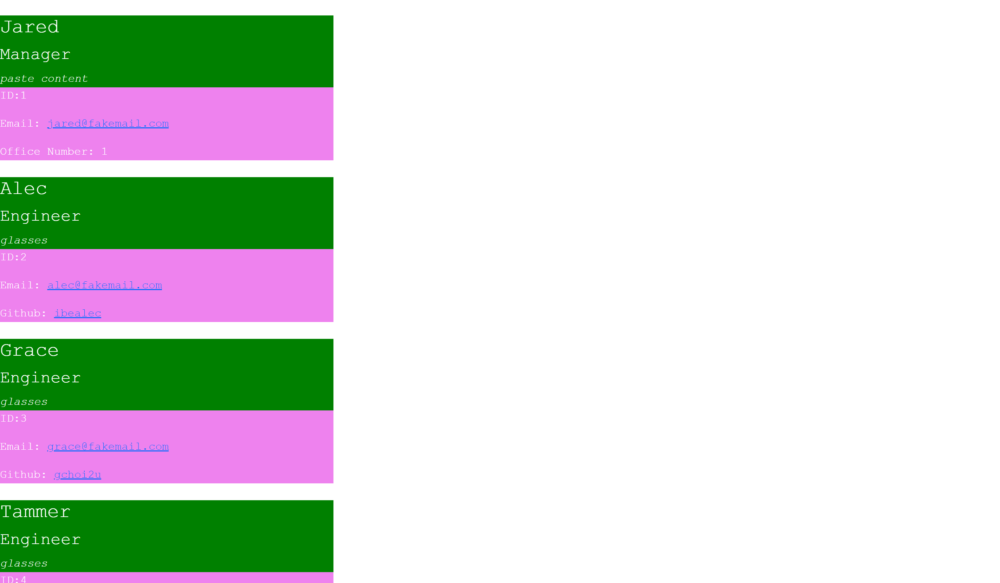

# Professional README Generator Starter Code readmen
This is a command-line application that generates a team profile with information on the members based on user input.
  
  
  
  
  ## Table of Contents
  1. [Installation](#Installation)
  2. [Usage](#Usage)
  3. [Video](#Video)
  4. [License](#License)
  5. [Contributing](#Contributing)
  6. [Questions](#Questions)
  
  ## Installation 
  Clone this repository by clicking on the green button that says 'Fork'.
  Remeber to run the command npm i and
  to install dependencies before running the application your command line.
  
  ## Usage
  Invoke the applicaton with the command 
  
  > node index.js 
  
  Answer the prompts that appear in the command line. After answering all the questions, this message will appear in the terminal: 
  "Your selected team profile has been successfully created! Check out the index.html to see your work!"
  If there is an error, an error message will appear in the terminal. 
  
  The team profile will then be generated based on user input and should appear in the index.html local page.
  
  ## Video
  
  Watch the demo video: (insert video here)
  
  [Team Profile Generator]

  example
 

  
  ## License
  This project operates under the MIT license
  
  
  
  ## Contributing 
  Contributions are welcome to fork the repoistory and contact me to report their progress.
  
  ## Questions
  
  GITHUB: https://github.com/Tojomojo
  EMAIL: liuya@uci.edu
  LINKEDIN: https://www.linkedin.com/in/yangyi-liu-5bbb1120a/
  

